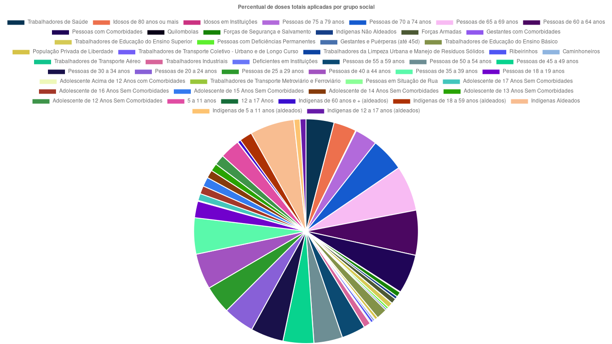
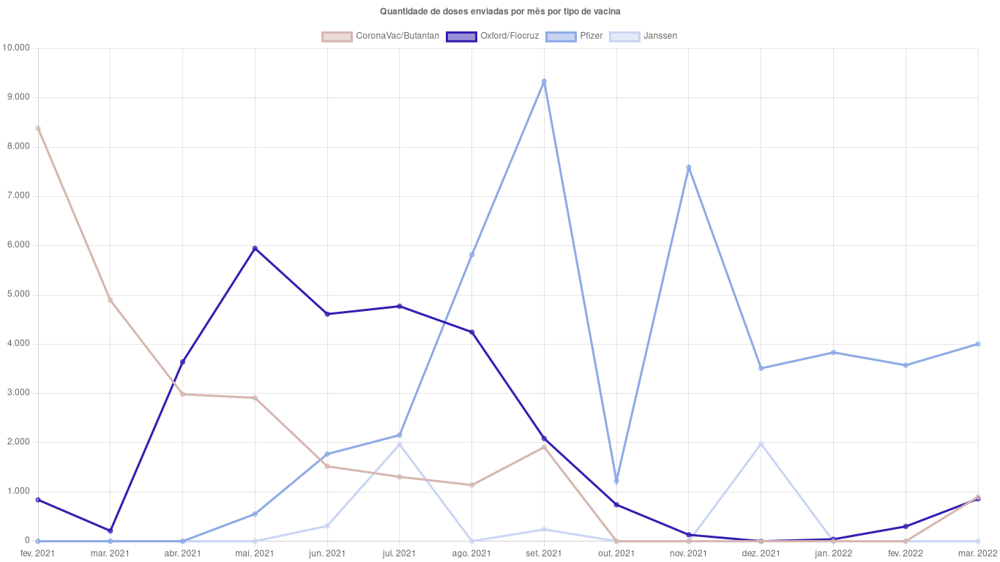

# vacinometro-aquidauanense

Este projeto faz a leitura das planilhas de [doses aplicadas](./src/data/doses-aplicadas.csv) e [doses enviadas](./src/data/doses-enviadas.csv) para o município de Aquidauana - MS. Feita a leitura, são gerados um gráfico de linhas e um gráfico de pizza, como exemplificado abaixo:

## Galeria

