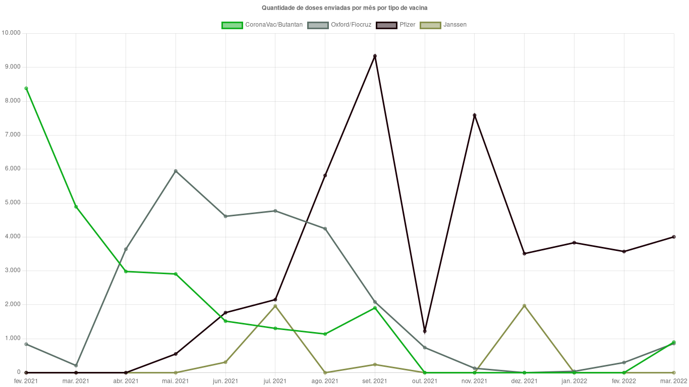

# vacinometro-aquidauanense

## Sumário

- [vacinometro-aquidauanense](#vacinometro-aquidauanense)
  - [Sumário](#sumário)
  - [Motivação](#motivação)
  - [Pilha de tecnologia](#pilha-de-tecnologia)
  - [Galeria](#galeria)
  - [Como rodar](#como-rodar)
    - [Pré-requisitos](#pré-requisitos)
    - [Passo a passo](#passo-a-passo)

## Motivação

Este app faz a leitura das planilhas de [doses aplicadas](./src/data/doses-aplicadas.csv) e [doses enviadas](./src/data/doses-enviadas.csv) por tipo de vacina e grupo social no município de Aquidauana - MS e plota [dois gráficos](#galeria) no diretório [`charts/`](./src/charts/): um gráfico de pizza apresentando o percentual de doses totais aplicadas por grupo social; e um gráfico de linhas apresentando a quantidade de doses enviadas por mês por tipo de vacina.

Este foi o segundo repositório de código apresentado no [Curso Superior de TSI do IFMS](https://www.ifms.edu.br/campi/campus-aquidauana/cursos/graduacao/sistemas-para-internet/sistemas-para-internet) como requisito para obtenção da nota parcial das atividades da unidade curricular Linguagem de Programação I.

## Pilha de tecnologia

As seguintes tecnologias foram utilizadas para desenvolver este app:

| Papel | Tecnologia |
|-|-|
| Ambiente de execução | [Node](https://nodejs.org/en/) |
| Linguagem de programação | [TypeScript](https://www.typescriptlang.org/) |
| Plotagem de gráficos | [Chart.js](https://www.chartjs.org/) |

## Galeria




## Como rodar

### Pré-requisitos

- [Node](https://nodejs.org/en/download/);
- [Yarn](https://yarnpkg.com/) (opcional).

### Passo a passo

1. Clone o repositório de código em sua máquina;
   
2. Abra um shell de comando de sua preferência (prompt de comando, PowerShell, terminal _etc_.);

3. Instale as dependências do projeto através do seguinte comando:

```console
$ npm install
```

Caso esteja utilizando o gerenciador de pacotes Yarn, execute o seguinte comando como alternativa:

```console
$ yarn
```

4. Finalmente, execute o seguinte comando para iniciar o app:

Para npm:

```console
$ npm run dev
```

Para Yarn:

```console
$ yarn dev
```